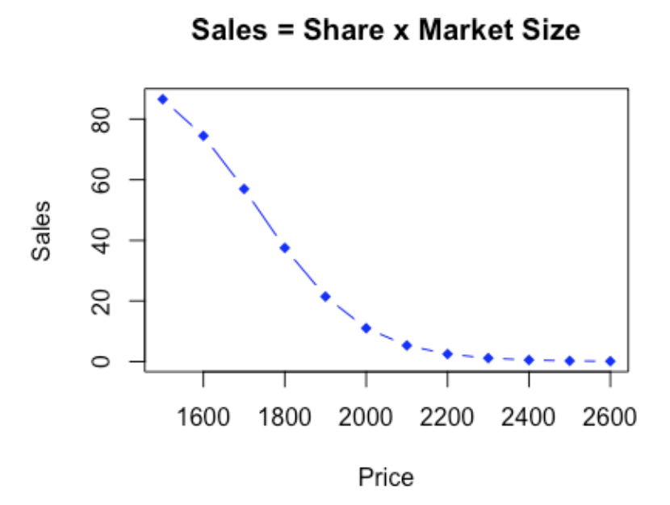
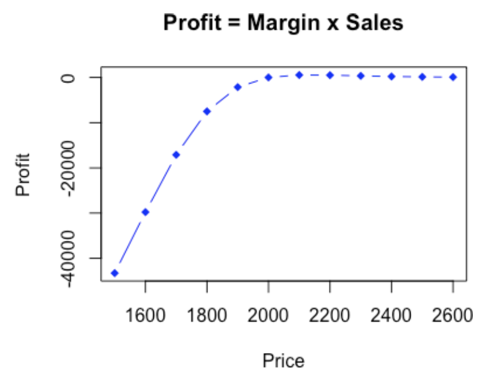

# Conjoint-Analysis

#### This project analyze consumer preferences and solve the problem of desingning a new product. It seeks to answer the following questions: 

* Partworths for each attribute level.
* Attribute Importance of each attribute
* Willingness to pay for each non-price attribute level
* Optimal price
* Maximum profit
* Market share associated with optimal price
* Plot market shares as a function of prices
* Plot profit as a function of prices

## Key Insights

#### Partworths for Each Coefficient

| Partworths       | Coefficients |
|------------------|-------------|
| **Intercept**    | 8.4         |
| Screen 75 inch  | 2.6         |
| Screen 85 inch  | 4.3         |
| Resolution 4K   | 5.4         |
| Sony            | 2.1         |
| **Price**       | -4.0        |

#### Attribute Importance

| Attributes         | Range | Importance |
|--------------------|-------|------------|
| Screen Size       | 1.7   | 12.88%     |
| Screen Resolution | 5.4   | 40.91%     |
| Brand Name        | 2.1   | 15.91%     |
| Price             | 4.0   | 30.3%      |

#### Willingness to Pay (WTP)

| Attribute          | WTP     |
|--------------------|---------|
| 75-inch screen    | $325.01 |
| 85-inch screen    | $541.27 |
| Sony-branded TV   | $260.47 |
| 4K resolution     | $680.81 |

#### Relationship between Sales and Price   &   Relationship between Profit and Price

|  |  |
|----------------------|----------------------|

## Summary

#### Optimal Price, Maximum Profit and Market Share
With coefficients rounded to 1 digit, we have optimal points as follows:
* Optimal Price: $2126.721
* Maximum Profit: $19.50413
* Corresponding Market Share: 0.1539135%

